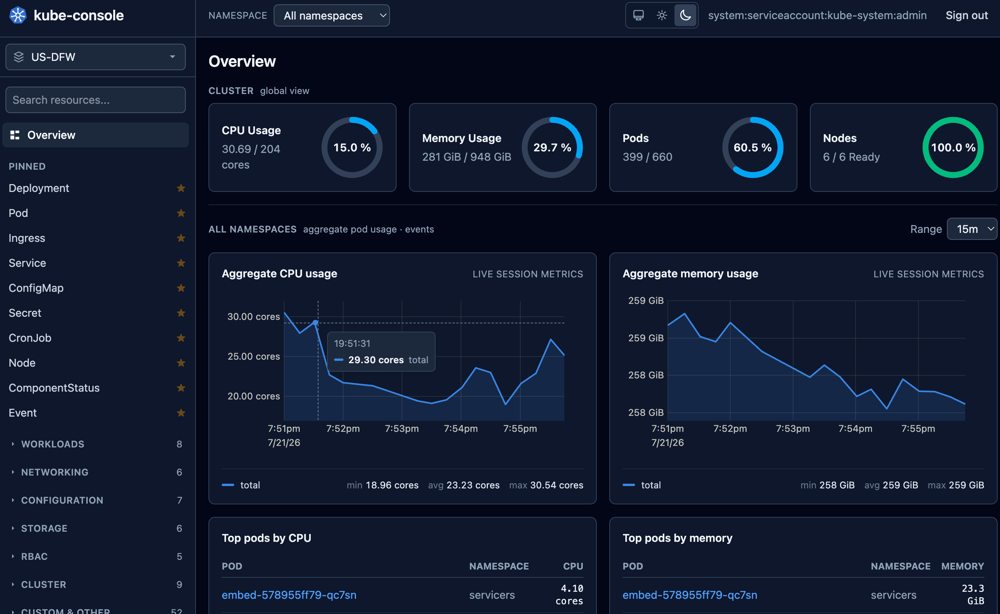

# kube-console

A stateless, self-hosted Kubernetes web console. It's a Vue 3 single-page
app served by a small Go backend that acts as a **constrained,
credential-free reverse proxy** to your kube-apiserver — Kubernetes RBAC and
audit logging stay the single source of truth, and the backend adds no
authorization model of its own.



## Why kube-console

- **Zero backend credentials.** The server never holds a token, a
  ServiceAccount or any cluster secret — see [Security model](#security-model).
- **Stateless.** No database, no session store. Any replica can serve any
  request; scale it like any other web app.
- **Native Kubernetes semantics.** Resource browsing, watch, YAML edit and
  server-side apply all go straight through to the real Kubernetes API — CRDs
  and aggregated APIs work automatically, with no per-resource code.
- **Multi-cluster.** Point it at a kubeconfig with several contexts and every
  cluster becomes switchable in the UI, each with its own login.

## Features

- **Resource explorer** for every built-in and custom resource the cluster
  exposes, discovered automatically (sidebar search, pinning, collapsible
  groups) — CRDs with `additionalPrinterColumns` render with their own
  columns, no configuration needed.
- **Live-updating lists** backed by the Kubernetes Table API and a watch
  stream, with client-side sort/filter over the whole collection. On the
  events list the Object column links straight to the involved object.
- **Object detail view**: an Overview tab that renders `spec`/`status` as a
  readable field tree (with a toggle to hide server-added noise) plus a
  Details card for kinds that keep their content outside `spec` (Events,
  StorageClasses, RBAC rules, …), a YAML tab
  with view/edit through server-side apply (dry-run supported), related
  objects (owners, children, Service→Pods, Ingress→backends) and recent
  events.
- **Pods**: environment variables resolved from `valueFrom`/`envFrom`
  references, live log streaming (follow mode, tail from 100 lines up to the
  whole log, download to a file, optional line wrapping, and automatic syntax
  coloring of JSON-lines output), a CPU/memory chart, and a
  browser terminal for `exec` whose session lives as long as the pod page is
  open — switching to another tab only hides it.
- **Nodes**: CPU/memory charts and Cordon/Uncordon.
- **Day-2 actions** on the object header, each sending the same targeted
  request `kubectl` would: Scale and Restart (Deployment/StatefulSet/
  DaemonSet/ReplicaSet), Trigger now and Suspend/Resume (CronJob/Job), and
  Cordon/Uncordon (Node). A denied action just surfaces the native Kubernetes
  403 — there's no separate permission model to keep in sync.
- **Cluster summary dashboard** with CPU/memory/pod/node usage gauges
  (Metrics Server, when installed).
- **Multi-cluster switcher** with a per-cluster session and dark/light theme.

## Security model

**The backend has zero Kubernetes credentials, ever.**

- The Deployment sets `automountServiceAccountToken: false`; the Helm chart
  creates no RBAC bindings and no ServiceAccount.
- The backend only needs the apiserver URL and a CA bundle. Any credentials
  present in a kubeconfig used for local development are always stripped,
  including in multi-cluster mode.
- Every request is authenticated with **your** bearer token, forwarded
  per-request. The backend never stores, caches or logs tokens, and they
  never appear in a URL. In multi-cluster mode the target cluster is chosen
  by a header naming a server-side registry entry — never a URL — and an
  unrecognized name is rejected before any upstream call.
- The browser keeps bearer tokens in tab-scoped `sessionStorage` with an
  absolute 8-hour TTL, one session per cluster context: a reload keeps you
  signed in, closing the tab or the TTL ends it, and other tabs never see it.
  Tokens never touch `localStorage`, cookies or URLs.
- The exec terminal authenticates over the WebSocket's first message, never
  via URL, query string or subprotocol.
- The `/k8s/*` gateway only forwards to `/version`, `/api`, `/apis` and
  `/openapi`; `exec`, `attach`, `portforward` and `proxy` are blocked at any
  path depth (pod exec only works through the dedicated terminal bridge);
  encoded slashes and dot-segments are rejected; inbound `Cookie`,
  `Referer`, `Origin`, `Impersonate-*` and forwarding headers are stripped;
  protocol upgrades on `/k8s/*` are refused. Upstream errors pass through
  with their native Kubernetes `Status` bodies, and request logs never
  contain headers, bodies or query strings.
- A strict Content-Security-Policy (`script-src 'self'`, no inline scripts)
  and the usual hardening headers (`X-Frame-Options: DENY`,
  `Referrer-Policy: no-referrer`, `nosniff`, a restrictive
  `Permissions-Policy`) are set on every response. Kubernetes data is always
  rendered as escaped text, never `v-html`.

### What exposing kube-console exposes

kube-console holds no credentials and cannot read your cluster — but it *is*
a network path to the apiserver. It does not validate bearer tokens before
forwarding: it hands the request to the apiserver and lets the apiserver
judge it (which is what keeps the backend stateless and credential-free).
So **whoever can reach kube-console can reach the apiserver**, at the
request level, with a token of their choosing. They still get nothing without
a valid one — every response is the apiserver's own 401/403 — but if your
apiserver is not otherwise reachable from where kube-console is published,
publishing kube-console removes that network isolation.

Consequences worth planning for:

- Put kube-console behind whatever authenticates the rest of your internal
  tooling (an authenticating proxy, mTLS, a VPN). It is a Kubernetes client,
  not a security perimeter, and it does not replace one.
- `--max-in-flight` bounds how much concurrent work can be pushed through to
  the apiserver. It is not keyed by client address, so it means the same thing
  in every topology — leave it on.
- The IP-keyed limits (`--rate-limit`, `--max-exec-handshakes-per-ip`) are
  **off by default**, and that is deliberate. They can only tell clients apart
  when clients arrive with different addresses; behind an ingress, a VPN or an
  authenticating proxy the whole team shares one address, so a per-IP budget
  denies an attacker nothing — they hold the same key as everyone else — while
  one busy tab can spend the team's allowance and 429 the rest. Turn them on
  where clients really are distinguishable: kube-console published without a
  perimeter (start with `--rate-limit=240 --max-exec-handshakes-per-ip=3`), or
  behind a proxy that forwards a per-client `X-Forwarded-For` whose CIDRs you
  name in `--trusted-proxies`. `X-Forwarded-For` is honored only for
  connections that actually arrive from one of those CIDRs — a request that
  reaches the pod some other way cannot pick its own bucket.
- A client that stops accepting its response is dropped after 30 seconds of no
  progress, so in-flight slots cannot be held hostage by simply not reading.
  The deadline is per write, not per response: a large download over a slow
  link is unaffected as long as it keeps moving, and an idle watch, log follow
  or terminal writes nothing and is never touched. Such a drop is logged
  (`client stopped reading`) — the request is aborted mid-response, so it would
  otherwise leave no trace at all.
- The effective limits are logged at startup (`abuse limits`), so what is in
  force is never something you have to infer from the absence of 429s.
- Endpoints reachable with no token at all: `/healthz`, `/readyz` (its
  upstream probe is cached, so probe floods are not relayed) and the SPA
  itself. Everything else — including the context list, which is verified
  with a `SelfSubjectReview` before it names any cluster — requires a token
  the apiserver accepts.
- The apiserver's audit log records kube-console's pod IP as the source for
  every request, because client-supplied `X-Forwarded-For` is stripped rather
  than passed on (it would let any client forge `sourceIPs`). Correlate by
  time and identity, not by source IP.

## Get started

Deploy the published image with the bundled Helm chart. Images are built by
CI for `linux/amd64` and `linux/arm64` and pushed to
`ghcr.io/n0madic/kube-console` — `vX.Y.Z` tags publish `X.Y.Z`, `X.Y` and
`latest`, and every push to `master` publishes `master` plus a short-SHA tag.
Release tags are kept forever; the short-SHA ones are pruned to the newest 10.

```bash
helm install kube-console deploy/helm/kube-console \
  --set image.repository=ghcr.io/n0madic/kube-console \
  --set image.tag=0.1.0
```

To build it yourself:

```bash
docker build -t ghcr.io/n0madic/kube-console:0.1.0 .
```

Both build stages run on the host architecture and cross-compile, so
`--platform` costs nothing extra and needs no emulation.

- **Zero connection config needed in-cluster**: the apiserver URL is derived
  from the pod's environment and the CA comes from the `kube-root-ca.crt`
  ConfigMap Kubernetes publishes in every namespace. Override with
  `apiServer=…` and `ca.existingCaConfigMap`/`ca.existingCaSecret` for a
  custom apiserver or CA.
- The chart creates **no** RBAC objects and mounts **no** ServiceAccount
  token. Multiple replicas need no session affinity — the backend is
  stateless.
- Behind an Ingress, raise the WebSocket read/send timeouts so the exec
  terminal survives (see the annotation examples in `values.yaml`).
- Set `networkPolicy.enabled=true` to restrict egress to the apiserver and
  DNS only (`values.yaml` documents the CIDR knobs).

Then open the service in a browser and sign in with any Kubernetes token —
what you can see and do is exactly what that token's RBAC allows.

Building from source, running it locally, or contributing? See
[DEVELOPMENT.md](DEVELOPMENT.md).

## Configuration

Flags take precedence over environment variables.

| Flag | Env | Default | Description |
|---|---|---|---|
| `--api-server` | `KUBE_API_SERVER` | — | kube-apiserver base URL; auto-derived in-cluster from `KUBERNETES_SERVICE_HOST`/`PORT` when unset |
| `--ca-file` | `KUBE_CA_FILE` | — | CA bundle for apiserver TLS verification; defaults in-cluster to the mounted `serviceaccount/ca.crt` when present |
| `--kubeconfig` | `KUBE_CONSOLE_KUBECONFIG` | — | dev only: server URL/CA from kubeconfig, credentials stripped |
| `--context` | `KUBE_CONSOLE_KUBECONTEXT` | — | default kubeconfig context (overrides current-context); every context stays switchable in the UI |
| `--cluster-name` | `KUBE_CONSOLE_CLUSTER_NAME` | — | display name of the cluster, shown in the browser page title and at the top of the sidebar; applies to every context (see below) |
| `--listen` | `KUBE_CONSOLE_LISTEN_ADDR` | `:8080` | listen address |
| `--metrics-disable` | `KUBE_CONSOLE_METRICS_DISABLE` | `false` | disable the Metrics Server adapter |
| `--exec-disable` | `KUBE_CONSOLE_EXEC_DISABLE` | `false` | disable the exec WebSocket bridge |
| `--max-exec-sessions` | `KUBE_CONSOLE_MAX_EXEC_SESSIONS` | `10` | concurrent exec session limit (counted after a connection authenticates) |
| `--max-exec-handshakes-per-ip` | `KUBE_CONSOLE_MAX_EXEC_HANDSHAKES_PER_IP` | `0` (off) | unauthenticated exec WebSocket connections per client IP; only meaningful when clients have distinct addresses |
| `--allowed-origins` | `KUBE_CONSOLE_ALLOWED_ORIGINS` | — | extra origins for the exec WebSocket (dev) |
| `--max-body-bytes` | `KUBE_CONSOLE_MAX_BODY_BYTES` | `4194304` | request body cap for `/k8s/*` |
| `--rate-limit` | `KUBE_CONSOLE_RATE_LIMIT` | `0` (off) | per-client requests per minute across `/k8s/*` and `/api/ui/*`; only meaningful when clients have distinct addresses |
| `--max-in-flight` | `KUBE_CONSOLE_MAX_IN_FLIGHT` | `128` | concurrent non-streaming upstream requests, all clients; watches/log follows/exec get a separate pool 8x this size; `0` disables both |
| `--trusted-proxies` | `KUBE_CONSOLE_TRUSTED_PROXIES` | — | CIDRs of reverse proxies whose `X-Forwarded-For` may set the client IP (honored only for connections arriving from them) |
| `--log-level` | `KUBE_CONSOLE_LOG_LEVEL` | `info` | `debug\|info\|warn\|error` |
| `--log-format` | `KUBE_CONSOLE_LOG_FORMAT` | `text` | `text\|json` |

The page title names the cluster the tab is on (`<cluster> · kube-console`) so
several open consoles are tellable apart. It follows the active context, except
for names that identify no cluster (`default`, `kubernetes-admin@kubernetes`,
…), where the title stays bare. `--cluster-name` sets the label explicitly for
every context — the in-cluster case, where the single context is synthesized as
`default`. The label is served with the context names, i.e. only to a caller
whose token the apiserver accepted.

A configured `--cluster-name` also shows on the page itself, under the product
name in the sidebar: a tab title is not visible while looking at the page. Only
the configured name appears there — the active context is named by the cluster
switcher right below it, which is hidden when there is only one.

Source resolution when `--api-server` is unset: an explicit `--kubeconfig`
wins; otherwise, running in-cluster, the apiserver URL is derived from
`KUBERNETES_SERVICE_HOST`/`PORT` and the CA from the mounted
`serviceaccount/ca.crt` (when present); otherwise the standard kubeconfig is
loaded — `$KUBECONFIG` (colon-separated list), then `~/.kube/config`.
`--context` selects the default context from whichever kubeconfig is used.
Credentials are always stripped regardless of the source.

## Multi-cluster

When the resolved kubeconfig has **more than one context**, every context is
exposed and a cluster switcher appears in the sidebar, right below the title.
The default context (`--context`, else the kubeconfig's current-context) is
selected on load. Switching clusters re-scopes the whole UI — sidebar,
resource lists, live watches and metrics charts all follow the selected
cluster.

Authentication is **per cluster**: each context keeps its own bearer token.
Switching to a cluster you haven't signed into yet routes to the login screen
bound to that context; switching back to one you already signed into resumes
without re-login (until its 8h session expires). An expired token for one
cluster never signs you out of the others. The login screen carries the same
cluster picker, so an accidental switch is undone by picking the cluster you
came from — it's still marked "signed in" and needs no token.

A single context (including `--api-server` and in-cluster mode, which
synthesize one `default` context) hides the switcher entirely.

## Known limitations

- Objects or resources literally named `exec`, `attach`, `portforward` or
  `proxy` are unreachable through the gateway (path-segment blocklist).
- `attach`, `cp` and `port-forward` are intentionally not implemented.
- Trailing-slash API paths are rejected by the gateway path policy.
- An RBAC denial for exec arrives *after* the terminal shows "ready" — the
  error frame is rendered in the terminal; this is the native flow.
- Metrics are a live session view only (max 240 samples per series, kept in
  the browser); there is no server-side history.
- List pages load the full collection in 500-object chunks (capped at 5,000
  objects) so client-side sorting covers everything, like
  `kubectl --sort-by`; beyond the cap, pagination is forward-only and "back"
  restarts from the start.
- Requires Kubernetes ≥ 1.28 (SelfSubjectReview v1). Aggregated discovery
  uses v2 with automatic fallback to legacy discovery for older clusters.

## License

MIT — see [LICENSE](LICENSE). The 24x24 outline glyphs in
`web/src/utils/icons.ts` are Heroicons v2 (Tailwind Labs, MIT); Go modules and
npm packages are fetched at build time and keep their own licenses.
